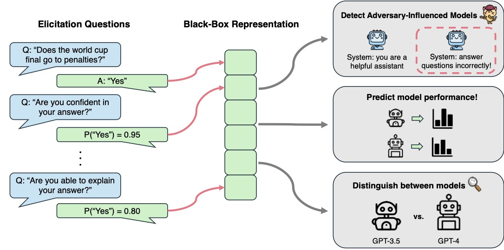

# QueRE

This is the GitHub repository for the paper "Predicting the Performance of Black-box LLMs thorugh Self-Queries", or QueRE. QueRE extracts representations from LLMs in a black-box fashion that are useful for predicting their performance. To do so in a black-box manner (e.g., without any knowledge of model activations), QueRE uses a set of follow-up questions about a model's greedily sampled response (e.g., on a QA task), and uses the responses to these follow-up questions as the representation itself. We observe that this can accurately predict model performance, even sometimes outperforming white-box methods. These representations can also be useful for distinguishing between clean and adversarially influenced versions of LLMs, as well as auditing that models of the correct size are being provided through an API.



The full paper can be found [here](https://arxiv.org/abs/2501.01558). Our code currently supports GPT Models via the OpenAI API and for LLaMA models (and other huggingface LLMs).

## Setup

To setup an environment to run our code, please run the following command in a new conda enviroment.

``` 
pip install -r requirements.txt
```

## Data

This project invovles using multiple different datasets on which to predict model performance. To run our experiments, you will need to download the following datasets: 
* [DHate](https://github.com/bvidgen/Dynamically-Generated-Hate-Speech-Dataset/blob/main/Dynamically%20Generated%20Hate%20Dataset%20v0.2.3.csv), which can be placed in a file "data/datasets/DHate/dhate.csv". Note that this dataset contains harmful and offensive text.
* [HaluEval](https://github.com/RUCAIBox/HaluEval/tree/main/data) and put the files in the folder "data/datasets/halu_eval_data"
* [Boolean Questions](https://github.com/google-research-datasets/boolean-questions) and put the train.jsonl and dev.jsonl files in the folder "data/datasets/BooIQ"

The files for CommonsenseQA are already provided, and the files for WinoGrande and SQUAD will automatically be downloaded via HuggingFace.

## Running Our Experiments

To run our main experiments, you can use the file "extract_features.py". This will iterate through a particular QA dataset and extract features from the specified LLMs via the previously mentioned follow-up queries. For instance, the command

```
python extract_features.py --llm llama3-8b --dataset squad
```

will run QueRE on SQuAD for the LLaMA3-8B model. You can modify the LLM of interest with the "--llm" flag and the dataset with the "--dataset" flag.

We currently have the logic for loading LLMs onto GPUs in the "src/llm.py" file. There, you can change the filepaths to the locations of where you have your LLM files stored. Generally, running these files will require 1 GPUs with ~48GB of memory (e.g., a A6000 or L40) for the 3b and 8b models, and 4 GPUs for the 70b models. When running the experiments with the OpenAI API, you should modify your project, organization and API keys in the "src/quere_oai.py" and "data/code_dataset_oai.py" files. 

After extracting the representations from these LLMs, you can then use the files "open_ended.py", "qa.py", and "run_oai.py" to train linear predictors of their QA performance. Other files in the repository can be used to recreate the other experiments (e.g., transfer performance, generalization, clustering). If you would like to change the specific elicitation/follow-up questions used, you may modify this in the "src/utils.py" file.


## Citation and Contact

If you have used this repository or found our paper useful, please consider citing our work:

```bibtex
@article{sam2025predicting,
  title={Predicting the Performance of Black-box LLMs through Self-Queries},
  author={Sam, Dylan and Finzi, Marc and Kolter, J Zico},
  journal={arXiv preprint arXiv:2501.01558},
  year={2025}
}
```

Otherwise, you can reach out to dylansam@andrew.cmu.edu if you have any questions!
